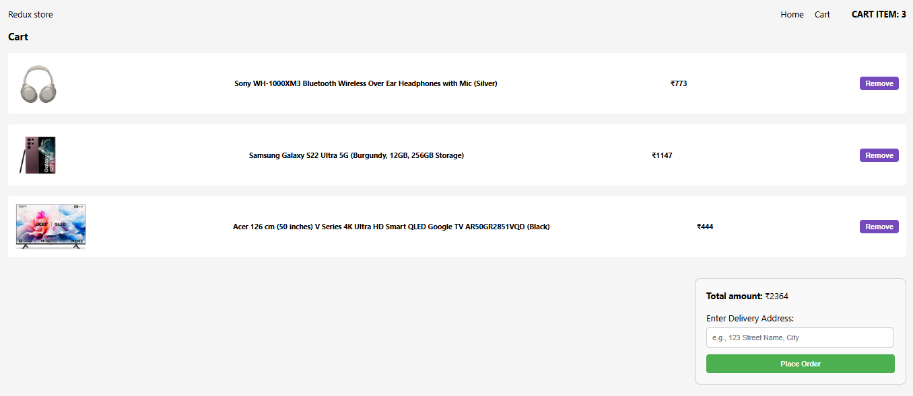

md
# 🛒 Redux Cart App

This is a simple React-Redux based Cart Application with state persistence using Redux Toolkit and Redux Persist. Users can view a list of products and add them to the cart. The cart retains its state even after a page refresh.

---

## 🔗 Live Demo

- 🌐 [Live Site 1](https://vkc-redux-gh1qfz5gp-vimals-projects-09a9f063.vercel.app/)
- 🌐 [Live Site 2](https://vkc-redux-aywcjvz1w-vimals-projects-09a9f063.vercel.app/)

---

## 🗂 Project Structure

├── public/
│   ├── product-page.png
│   └── cartpage.png
├── src/
│   ├── component/
│   │   ├── Navbar.js
│   │   └── Products.js
│   ├── pages/
│   │   ├── Home.js
│   │   └── Cart.js
│   ├── store/
│   │   ├── cartSlice.js
│   │   ├── productSlice.js
│   │   └── store.js
│   ├── App.js
│   └── index.js

---

## 🖼️ Screenshots

### 🏠 Home / Products Page  


### 🛒 Cart Page  


---

## 🔧 Technologies Used

- React.js – Frontend library
- Redux Toolkit – Modern Redux setup for state management
- React Redux – Connects Redux store to React components
- Redux Persist – Persists cart state in localStorage
- React Router DOM – For client-side routing
- FakeStore API – Dummy data API for products

---

## 📦 Features

- Fetch & display product list from API
- Add items to cart with visual “Added” button effect
- View cart items on a separate page
- Persistent cart using Redux Persist
- Responsive UI with clean layout

---

## 🔄 How It Works

1. Products are fetched from the FakeStore API using `createAsyncThunk` inside `productSlice.js`.
2. Cart is managed using `cartSlice.js` — includes add to cart functionality.
3. Redux Persist saves cart state to `localStorage` even after refresh.
4. "Add to Cart" button temporarily changes to "Added" for 2 seconds.
5. React Router handles navigation between `/` (Home) and `/cart`.

---

## 📥 Installation & Run Locally

```bash
npm install
npm start
````

The app will run at `http://localhost:3000`

---

## 📂 GitHub Repository

📌 [GitHub Source Code](https://github.com/Munchunnce/vkc_redux_s)

---

## ✍ Author

Developed by **Vimal Kumar Chaudhary**

````

---

### 📌 Important Notes:
- Make sure `product-page.png` and `cartpage.png` are placed in the `/public` folder ✅
- After pasting this in your `README.md`, run:

bash
git add README.md
git commit -m "Updated README with full project details"
git push


